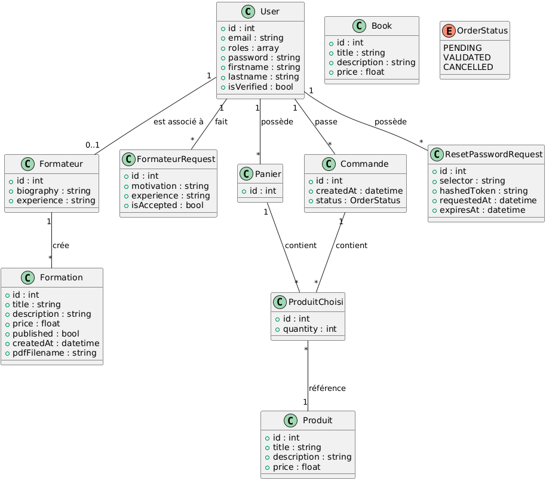
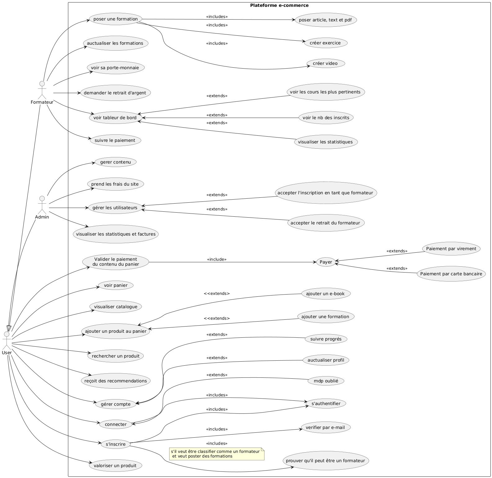

# Présentation du Projet E-learning Boutique

## 1. Thème de la boutique

- Description générale du thème

- Objectifs de la plateforme

- Public cible

- Valeur ajoutée par rapport à la concurrence

## 2. Diagramme des classes

## 3. Cas d'utilisation

## 4. Rôles et responsabilités de chaque membre

| Membre         | Rôle principal                 | Tâches réalisées                      |
| -------------- | ------------------------------ | ------------------------------------- |
| Med Amin       | Développement back-end Symfony | Gestion des formations, statistiques  |
| Mohanned       | CRUD des formations            | Développement du controller Formation |
| [Nom membre 3] | Front-end, intégration         | Dashboard, design                     |
| [Nom membre 4] | Tests et documentation         | Tests fonctionnels, rédaction doc     |

## 5. Fonctionnalités principales (minimum requis + idées bonus)

### Minimum requis

- Authentification et inscription

- Gestion des rôles (user, formateur, admin)

- CRUD des formations

- Panier et achat de formations

- Gestion des utilisateurs par l'admin

### Idées bonus

- Statistiques pour les formateurs

- Système de notation/commentaires

- Envoi d'email de confirmation

- Génération de certificat

- Filtrage avancé des formations

- Dashboard dynamique pour les admins
